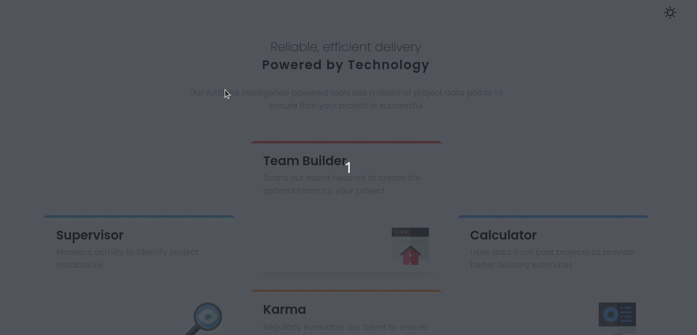

# Hello everyone 🙌

this is challenge that challenged my [frontendmentor.io](https://www.frontendmentor.io/home). i hope you enjoy my project 
 

## features 

- ### DarkMode 🌔 ☀️ & typing + fade effect
   

  

- ### Responsive design 📱
   
  

- ### accessibility 👨‍🦯
     

     #### accessibility keyword ⌨️
     - Alt + Shift + D  : change color theme
     - Alt + Shift + F  : go to frontendmentor.io
     - Alt + Shift + R  : go to my github repository
  

## thank you very much ✋
