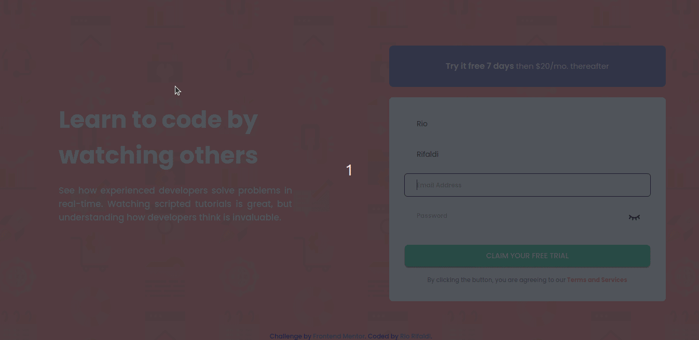
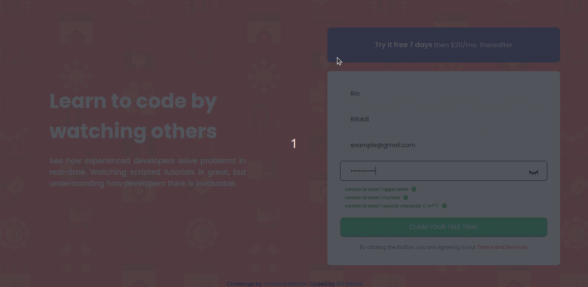

# Hello everyone ✋
## welcome to my project [launch here 🚀](https://rio-rifaldi.github.io/intro-component-signup/app/index.html)

this is a project that chalenged by [frontendmentor.io](https://www.frontendmentor.io/home) i hope you enjoy my little project.

## features in my project

- ### form validation (prevent blank fill input )
    
    
- ### password validation
    

- ### modal box message
    

i hope you enjoy my project
thank you ✋